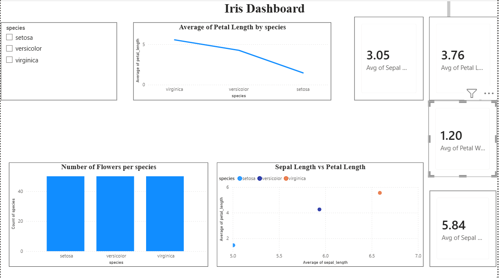

## Iris Dataset Analysis

### Overview
This project performs a complete data analysis on the Iris dataset
containing 150 flower samples across 3 species: Setosa, Versicolor
and Virginica.

### Dataset
- Iris Dataset
- **Rows:** 150 (147 after cleaning)
- **Columns:** sepal_length, sepal_width, petal_length, petal_width, species

### Tools Used
- **Python**: pandas, numpy, matplotlib, seaborn, scikit-learn
- **Power BI**

### Tasks Completed

#### Level 1
- **Task 1:** Data Cleaning & Preprocessing
  - Removed 3 duplicate rows
  - Handled missing values
  - Standardized species column
  - Detected outliers using IQR

- **Task 2:** Exploratory Data Analysis
  - Summary statistics
  - Histograms, boxplots, scatter plots
  - Correlation heatmap

#### Level 2
- **Task 1:** Regression Analysis
  - Predicted petal_length from sepal_length
  - Linear Regression model
  - Evaluated with R-squared and MSE

- **Task 3:** Clustering Analysis (K-Means)
  - Standardized features
  - Used Elbow method to find optimal k
  - Applied K-Means with k=3
  - Visualized clusters

#### Level 3
- **Task 1:** Predictive Modeling (Classification)
  - Trained Decision Tree, Logistic Regression, Random Forest
  - Compared accuracy, precision, recall and F1-score
  - Hyperparameter tuning with Grid Search

- **Task 2:** Dashboard (Power BI)
  - Interactive dashboard with slicer
  - Bar chart, line chart, scatter plot
  - KPI cards showing average measurements

### Key Findings
- Setosa is clearly separated from other species
- Petal length and petal width are strongly correlated
- Random Forest gave the best classification accuracy
- K-Means successfully grouped flowers into 3 clusters

### Files in this repository
- 'Iris analysis.ipynb'- Jupyter notebook with all analysis code 
- 'Iris.pbix'- Power BI interactive dashboard
- 'Iris_cleaned.csv'- Cleaned version of the dataset

  ##  Screenshots

